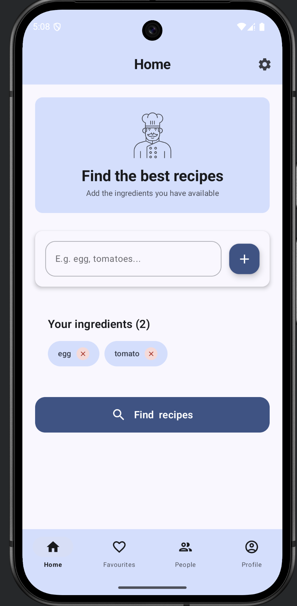
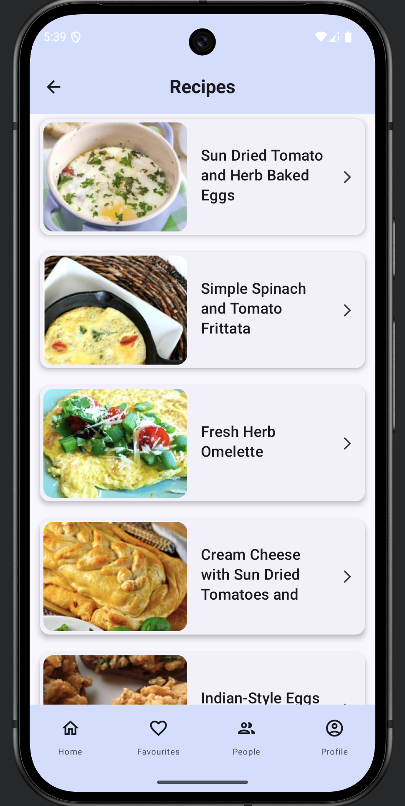
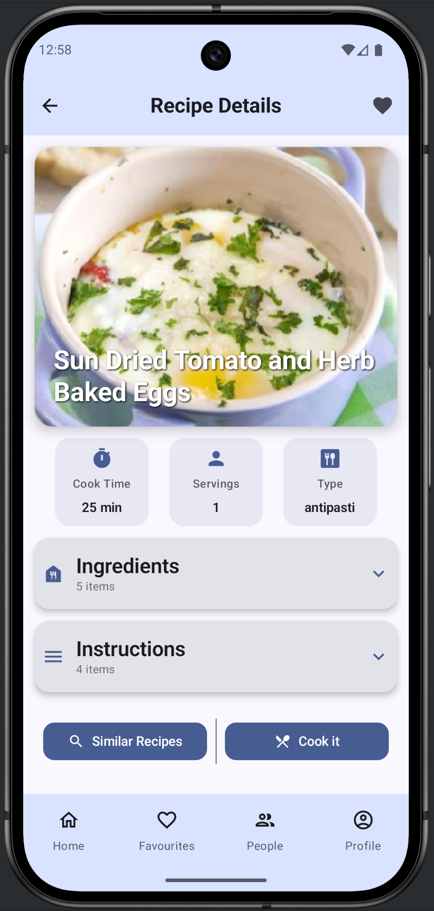
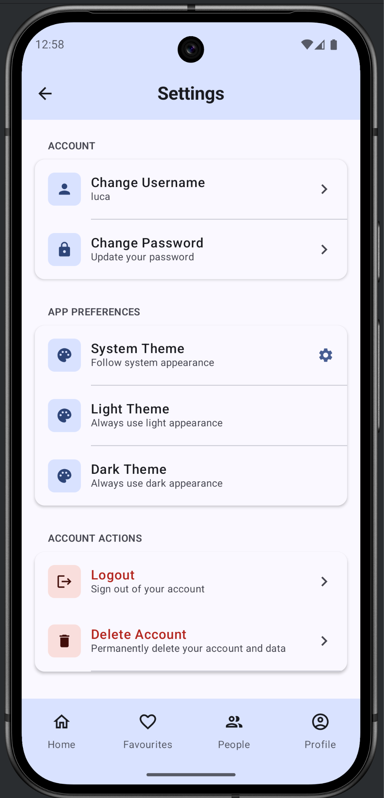
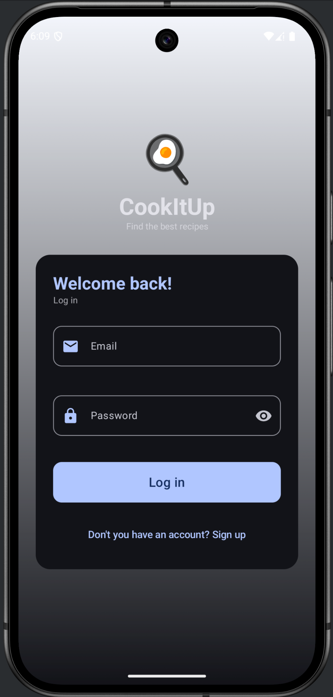

# CookItUp 🧑‍🍳

CookItUp is an android application that helps users discover and post cooked recipes. It provides a platform for food enthusiasts to explore new dishes, save their favorite recipes, and see what others are cooking. It fetches from [Spoonacular API](https://spoonacular.com/food-api) to get a wide variety of recipes.

## Features 🛠️
- Discover new recipes from a vast collection.
- Post your own cooked recipes with photos and descriptions.
- Save favorite recipes (in local storage) for easy access later.
- Deep link authentication for secure login.

## Storage ⛁
- Uses Room Database for local storage of favorite recipes.
- Supabase for backend services and authentication.

## Screenshots 📱

  
  
  
  
  

